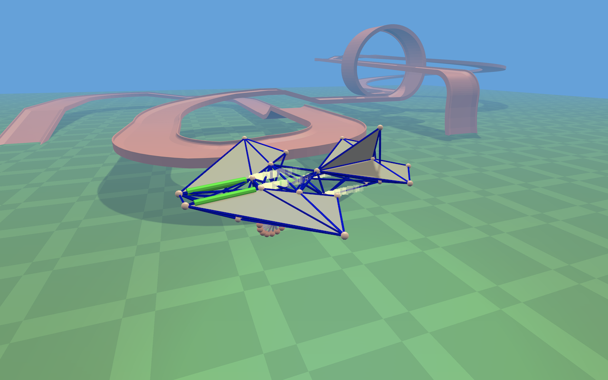
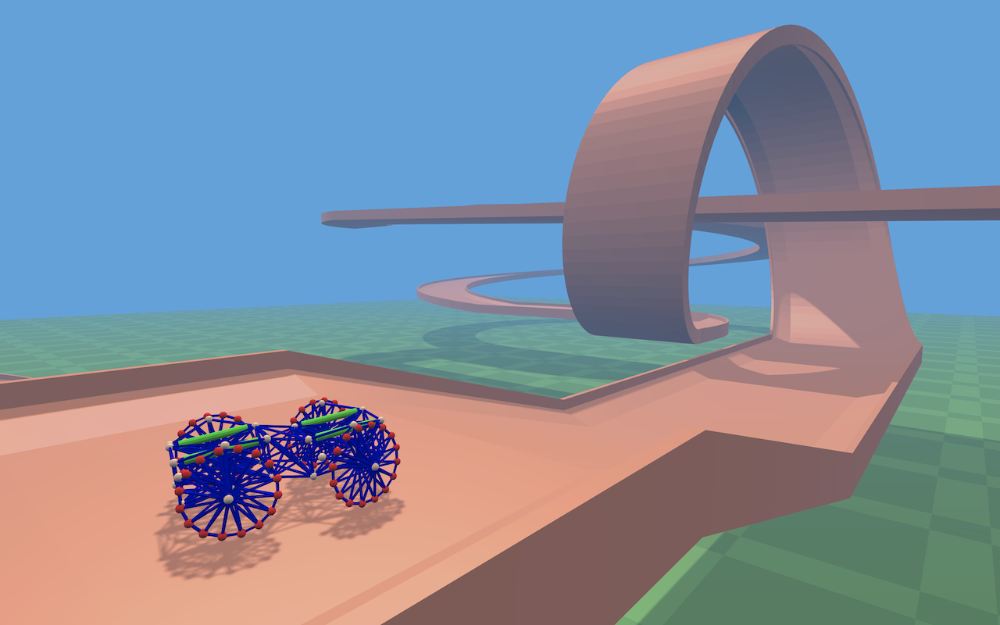

# Spring Physics

A playground project to play with graphics and explore the physics of structures built with springs. Inspired by Dream
Car Builder. Uses Vulkan with custom C++ wrappers from the Etna library.

